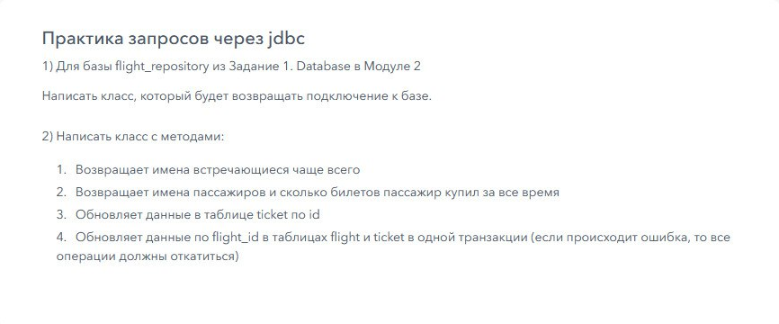

1. Для базы flight_repository из Задание 1. Database в Модуле 2
   Написать класс, который будет возвращать подключение к базе.

2. Написать класс с методами:
   Возвращает имена встречающиеся чаще всего
   Возвращает имена пассажиров и сколько билетов пассажир купил за все время
   Обновляет данные в таблице ticket по id
   Обновляет
   данные по flight_id в таблицах flight и ticket в одной транзакции (если
   происходит ошибка, то все операции должны откатиться)
