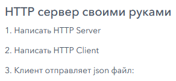

# Задание 5 http-rever-client


```json
{
    "info": "salary.by",
    "employees": [
        {
        "id": "01",
        "name": "Иванов И.И.",
        "salary": 500,
        "tax": 200
        },
        {
        "id": "02",
        "name": "Петров П.П.",
        "salary": 1500,
        "tax": 100
        },
        {
        "id": "03",
        "name": "Сидоров С.С.",
        "salary": 5500,
        "tax": 50
        }
    ]
}
```


```html
<!DOCTYPE html>
<html lang="en">
<head>
    <title>Salary</title>
</head>
<body>

<table>
    <tr>
        <th>Total income</th>
        <th>Total tax</th>
        <th>Total profit</th>
    </tr>
    <tr>
        <td>${total_income}</td>
        <td>${total_tax}</td>
        <td>${total_profit}</td>
    </tr>
</table>
</body>
</html>
```
