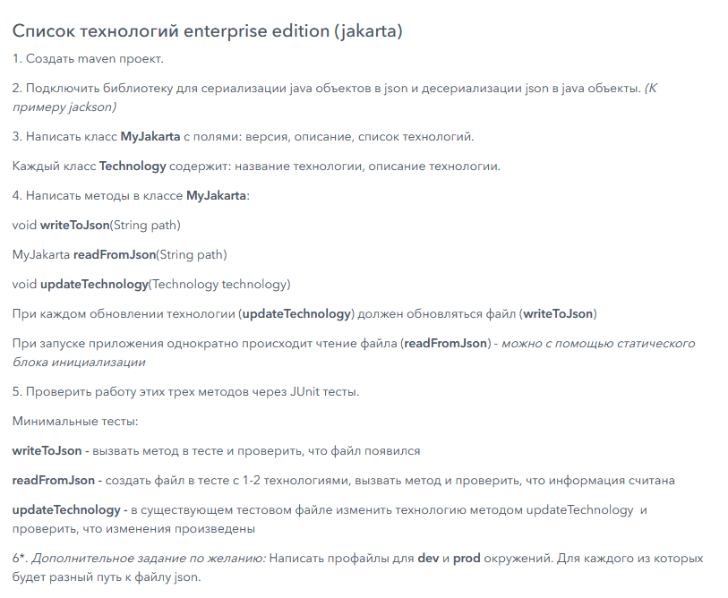
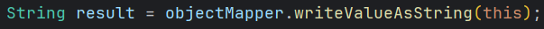
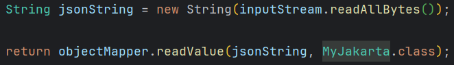
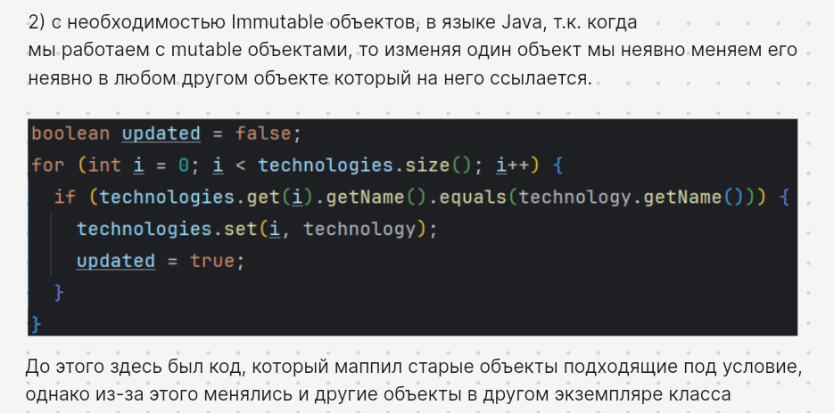
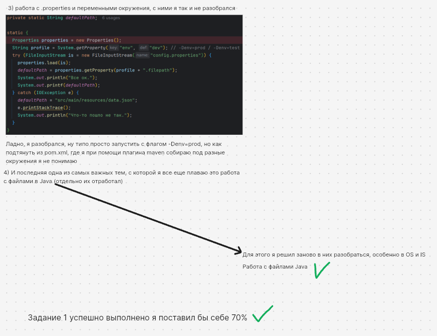

# Задание:

---

Во время выполнения этого задания я изучил новые инструменты:

1. #### Jackson - ObjectMapper, а так же его методы

Замапить объект в строку.

Размапить объект при помощи строки.

